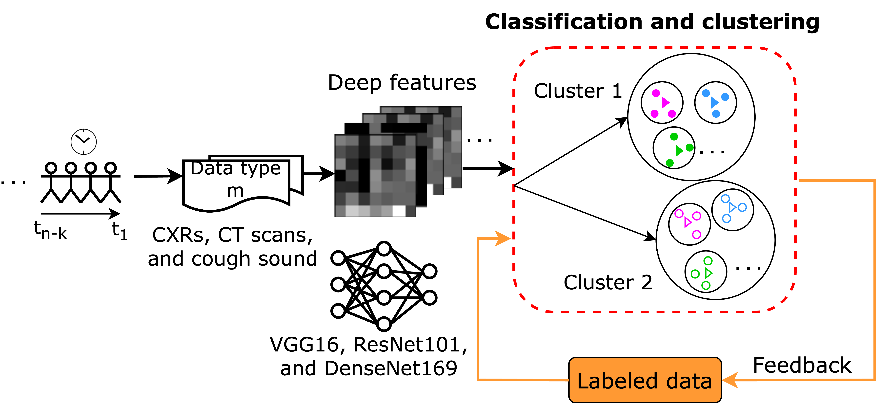

# Active Learning to Minimize the Possible Risk of Future Epidemics
Official repository for Active Learning to Minimize the Risk of Future epidemics, published at IEEE CAI conference and springer book. The publications are avalable at the links:
* Conference paper: [IEEE CAI, 2023](https://ieeexplore.ieee.org/abstract/document/10194994)
* Book: [SpringerBriefs in Applied Sciences and Technology book series, 2023](https://link.springer.com/book/10.1007/978-981-99-7442-9)


To reproduce our experiments, use following packages:
* Python: 3.8.2
* Tensorflow: 2.15.1
* Numpy: 1.26.3
* Scikit-learn: 1.3.0
* Matplotlib: 3.8.2

Also availble in the requirements.txt file. 

Note: You can install the requirements.txt file, but it is specific to the MacOS (M1 architecture).


To run the experiments, currently, only Jupyter notebooks are available. Open the notebook for corresponding data and run all the code shell. Change the path/location to the dataset and path to save the pickel file and excel report as shown in comment of the code. 

## Schema 
Illustration of Active Learning (or human-in-the-loop machine learning) framework using a feedback loop we termed mentoring. Mentoring refers to interference of the human Expert in the traning loop when the model commits a mistake.



## Reference and Citation
Please refer to our work:

```
Nakarmi, Suprim, and K. C. Santosh. "Active learning to minimize the risk from future epidemics." 2023 IEEE Conference on Artificial Intelligence (CAI). IEEE, 2023.
```

BibTex citation:
```
@inproceedings{nakarmi2023active,
  title={Active learning to minimize the risk from future epidemics},
  author={Nakarmi, Suprim and Santosh, KC},
  booktitle={2023 IEEE Conference on Artificial Intelligence (CAI)},
  pages={329--330},
  year={2023},
  organization={IEEE}
}
```


